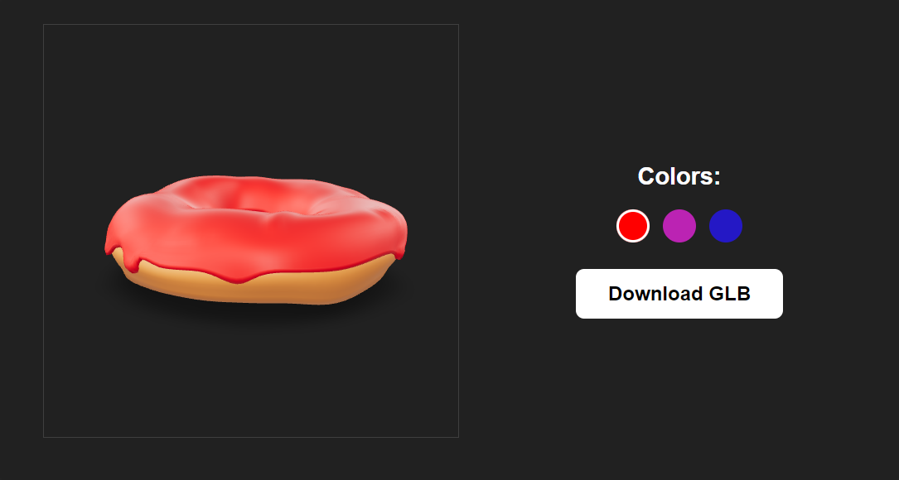

# 3D Model Project

## Overview

This project is a showcase of a 3D model viewer with interactive features. It allows users to explore different colors of a 3D model and download corresponding GLB files.

## Features

- Interactive 3D model viewer
- Color customization options
- GLB file download functionality

## Development

The project was developed using HTML, CSS, and JavaScript. The 3D model viewer is powered by the Model Viewer API. The code is modular and organized for easy maintenance and future enhancements.

## How to Use

1. Open the HTML file in a web browser to start interacting with the 3D model.
2. Use the provided color options to customize the model.
3. Click the "Download GLB" button to download the corresponding 3D file.

Feel free to explore and enjoy the project!

