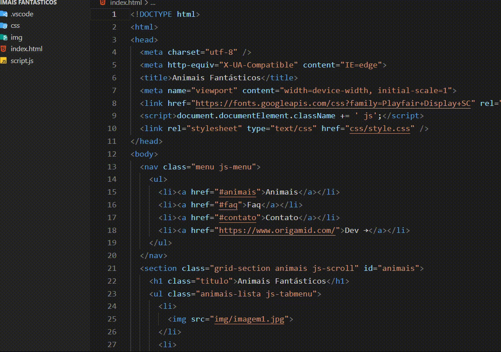

 <h2>Fantastic Animals - HTML, CSS and JS</h2>
   
Using JS and CSS effects like accordion, fading animation, scroll animation and so on. 

    
 
 
 
 
 <h2>Coding</h2>

 Marks with JS class inside CSS 

