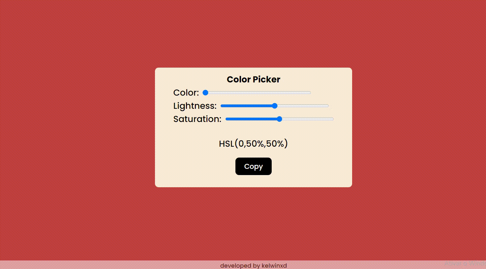

 <h2>Color Picker - JS, HTML & CSS</h2>
   
Thinking about making color styling easier and more flexible for programmers, I created an interface that generates custom colors and copies the HSL code, from programmer to programmer. 

    
 