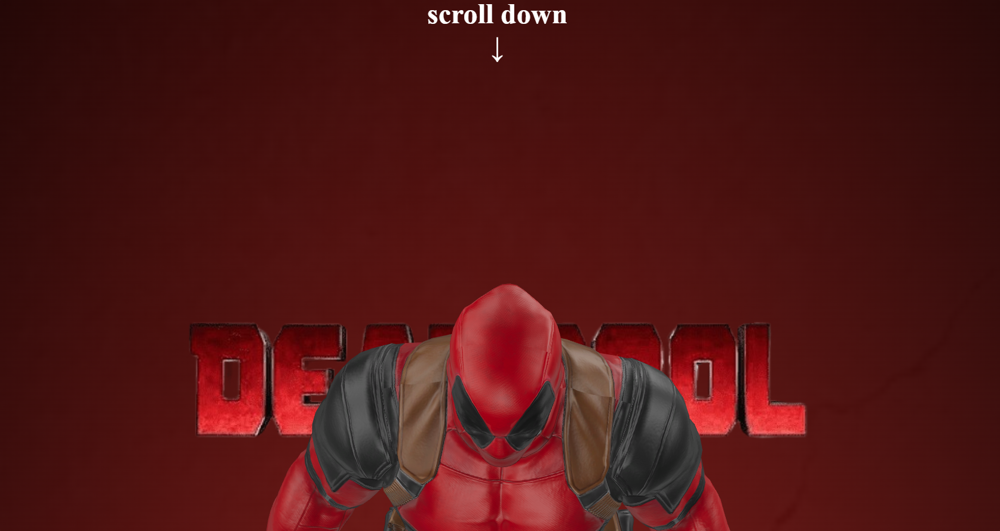
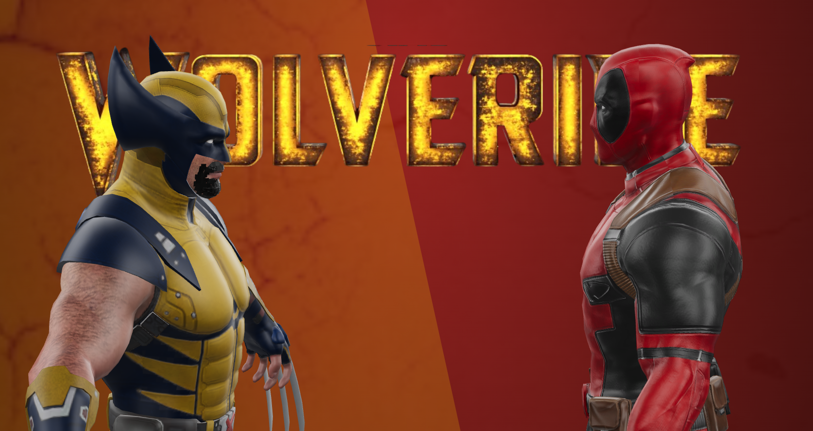

# Parallax Scroll Project

## Description

This project demonstrates a simple parallax effect during page scrolling. The parallax effect is achieved by moving objects at different speeds, creating an illusion of depth.

## Project Contents

- `index.html`: HTML file containing the basic page structure.
- `style.css`: CSS file with styles to create the parallax effect.
- `script.js`: JavaScript file that handles the parallax effect during scrolling.
- `Blender `: To model and animate.

