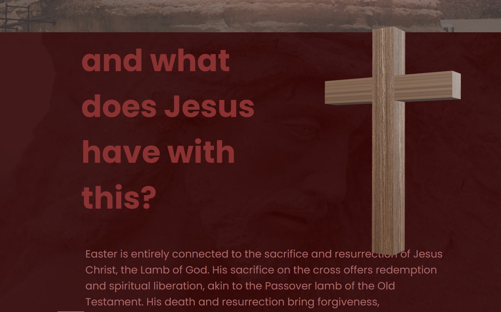

# Easter Explanation Website

This project is a website created to explain the significance of Easter. It utilizes HTML5, CSS, and JavaScript to create an interactive web experience that educates visitors about the meaning of Easter.

## Project Overview

Easter is a significant religious holiday celebrated by Christians worldwide. This website aims to provide an explanation of the true meaning of Easter, focusing on the death and resurrection of Jesus Christ.

The website features the following components:

- **HTML5**: The structure of the website is built using HTML5 to create semantic markup for various elements such as headers, paragraphs, and lists.

- **CSS**: Cascading Style Sheets (CSS) are used to style the website, providing visual enhancements such as colors, fonts, and layout formatting.

- **JavaScript**: JavaScript is used to add interactivity to the website, allowing for dynamic content updates and user interaction. For example, JavaScript may be used to implement animations, event handling, and form validation.

