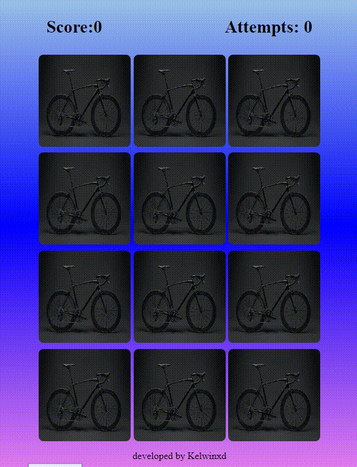
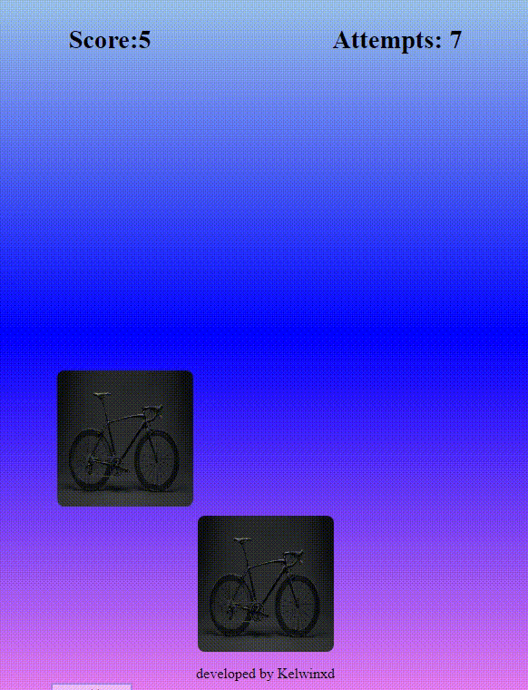

 <h2>Memory Game - JS, HTML & CSS</h2>
   
For this memory game, first, I created an array with objects representing each image. Then, I duplicated them to have their pairs. The random shuffling is done using the Math.random function that I added to the code. 

    
 
 
 
 
 <h2>Finishing</h2>

And upon completing the game, I added a display: block to the closing div, so that when clicking OK, the page refreshes, and the cards are shuffled again.

