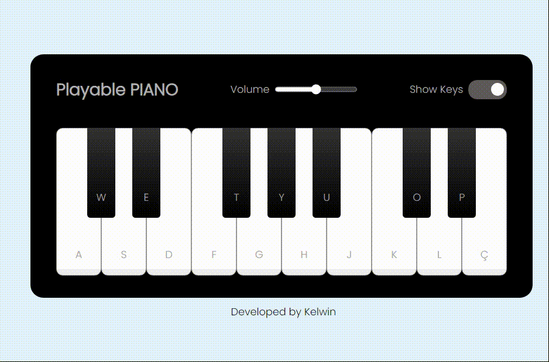

 <h2>Piano Playable - HTML, CSS & JS</h2>
   
I used an audio constructor and created a function called `playTune()`, where I associated the pressed key with the corresponding audio file name in .wav format. I also added additional elements such as a volume controller using an input range and a checkbox to disable the keys, for which I redesigned the appearance.

    
 
 
 
 
 
