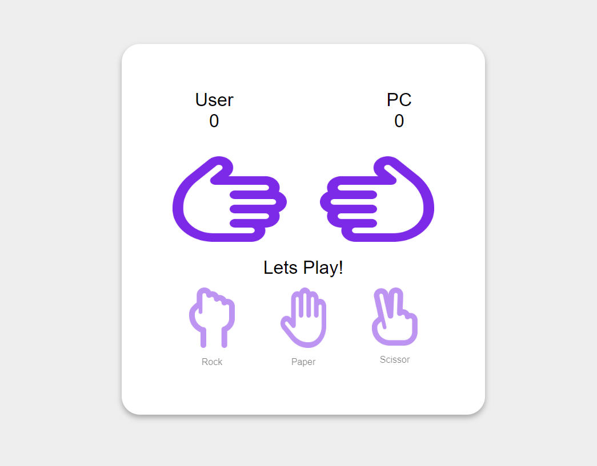

# Jogo Pedra, Papel e Tesoura

Este é um jogo simples de pedra, papel e tesoura desenvolvido utilizando HTML, CSS e JavaScript. O jogo permite que o jogador escolha entre pedra, papel e tesoura, e então jogue contra o computador.

## Demonstração

## Funcionalidades

- O jogador pode escolher entre pedra, papel e tesoura clicando nos botões correspondentes.
- O computador faz uma escolha aleatória entre pedra, papel e tesoura.
- O resultado do jogo é exibido na tela.

## Como Jogar

1. Abra o arquivo `index.html` em seu navegador.
2. Clique no botão correspondente à sua escolha: pedra, papel ou tesoura.
3. Aguarde o computador fazer sua escolha.
4. O resultado do jogo será exibido na tela.

## Tecnologias Utilizadas

- HTML: Utilizado para a estrutura básica da página.
- CSS: Utilizado para estilizar a aparência do jogo.
- JavaScript: Utilizado para implementar a lógica do jogo e a interação do usuário.

## Como Contribuir

Se você gostaria de contribuir para este projeto, siga estas etapas:

1. Faça um fork do repositório.
2. Clone o repositório forkado para o seu computador.
3. Faça suas alterações e adições.
4. Faça um commit das suas mudanças.
5. Envie um pull request para o repositório original.

## Créditos

Este jogo foi desenvolvido por [Seu Nome].

## Licença

Este projeto está licenciado sob a [Licença MIT](LICENSE).
