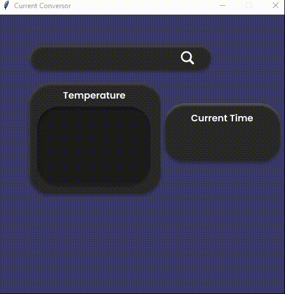
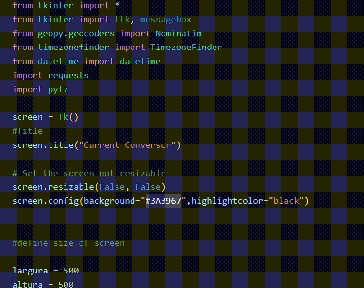

 <h2>WINTER FINDER - PYTHON, API & Tkinter</h2>
   
I used Python and Tkinter to develop the interface.

    
 
 
 
 
 <h2>Coding</h2>

 I've imported requests and modules, working with timezoneFinder and Apis. 

